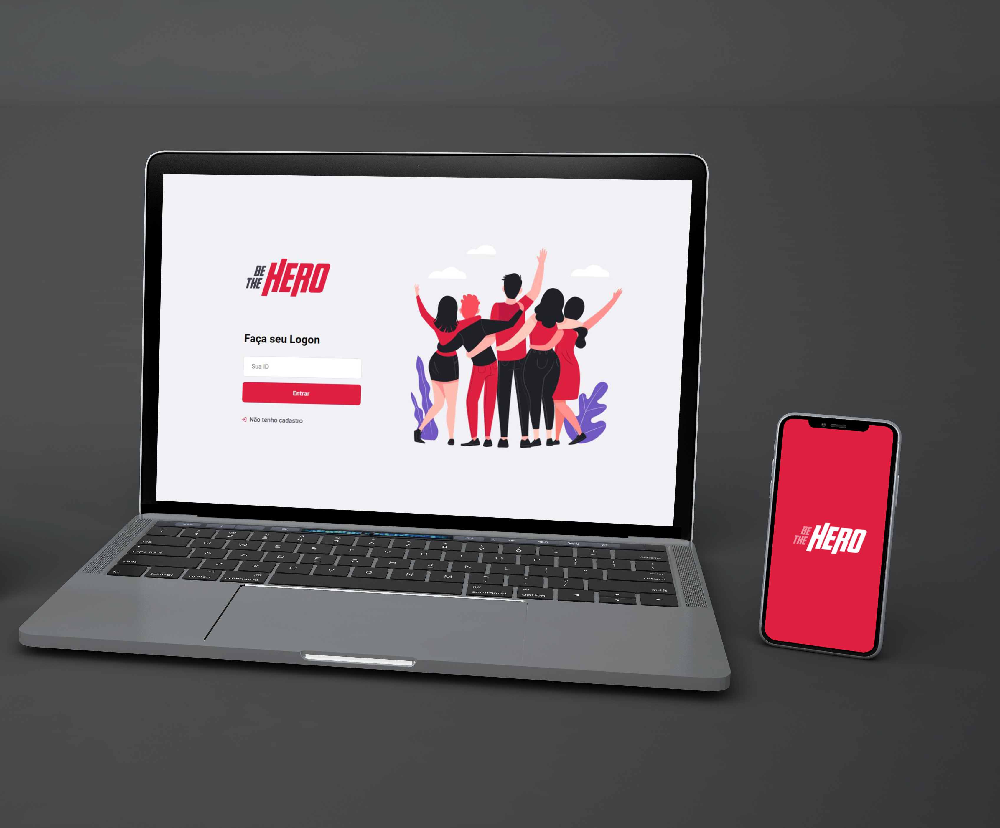

<h1 align="center">
    
</h1>

<h4 align="center"> 
	 🚀 Semana OmniStack 11.0
</h4>
<p align="center">
  

  
	
  <a href="https://www.linkedin.com/in/dhione-castilho-barbosa-45462961/">
    
  </a>

<a aria-label="Completed" href="https://rocketseat.com.br">
    </img>
  </a>
  
   <a href="https://github.com/DhioneCastilhoBarbosa/SemanaOnmiStack11/stargazers">
    
  </a>
</p>

<p align="center">
  <a href="#-Projeto">Projeto</a>&nbsp;&nbsp;&nbsp;|&nbsp;&nbsp;&nbsp;
  <a href="#rocket-Tecnologias">Tecnologias</a>&nbsp;&nbsp;&nbsp;|&nbsp;&nbsp;&nbsp;
  <a href="#-Como-usar">Como usar</a>&nbsp;&nbsp;&nbsp;|&nbsp;&nbsp;&nbsp;
  <a href="#memo-license">License</a>
</p>

## 💻 Projeto

Aplicação web e Mobile desenvolvida durante a Semana OmniStack 11.0 realizado pela [Rocketseat](https://rocketseat.com.br/). Consiste em uma aplicação denonimada "Be The Hero" que cadastra os casos de ONGs atraves da versão web e as pessoas que gostaria de ajudar este casos podem ter acesso atraves a aplicação mobile onde pode esta analisando as informações e contribuindo com o caso selecionado.

<h1 align="center">
    
</h1>


## 🚀 Tecnologias 

O projeto foi desenvolvido com as principais tecnologias:

- [Node.js](https://nodejs.org/en/) 
- [React](https://reactjs.org)
- [React Native](https://facebook.github.io/react-native/)
- [Expo](https://expo.io/)


## :information_source: Como usar

Para clonar e executar este aplicativo, você precisará do [Git](https://git-scm.com), [Node.js](https://nodejs.org/en/) e [NPM](https://docs.npmjs.com) instalados no seu computador.


### Intalação da  API

No terminal de os seguintes comandos:
```bash
# Clone o repositorio
$ git clone https://github.com/DhioneCastilho/SemanaOnmiStack11

# Abra cada um dos repositorios 
$ cd SemanaOmnistack11/backend
$ cd SemanaOmnistack11/frontend
$ cd SemanaOmnistack11/mobile

# instale as dependencias
$ npm install

# Rode as migrations
$ npm knex migrate.latest 

# inicie as Aplicações backend e frontend
$ npm start

# inicie as Aplicações mobile
$ expo start
```

## :memo: License

Este projeto está sob a licença MIT. Veja o [LICENSE](LICENSE.md) para mais detalhes.
